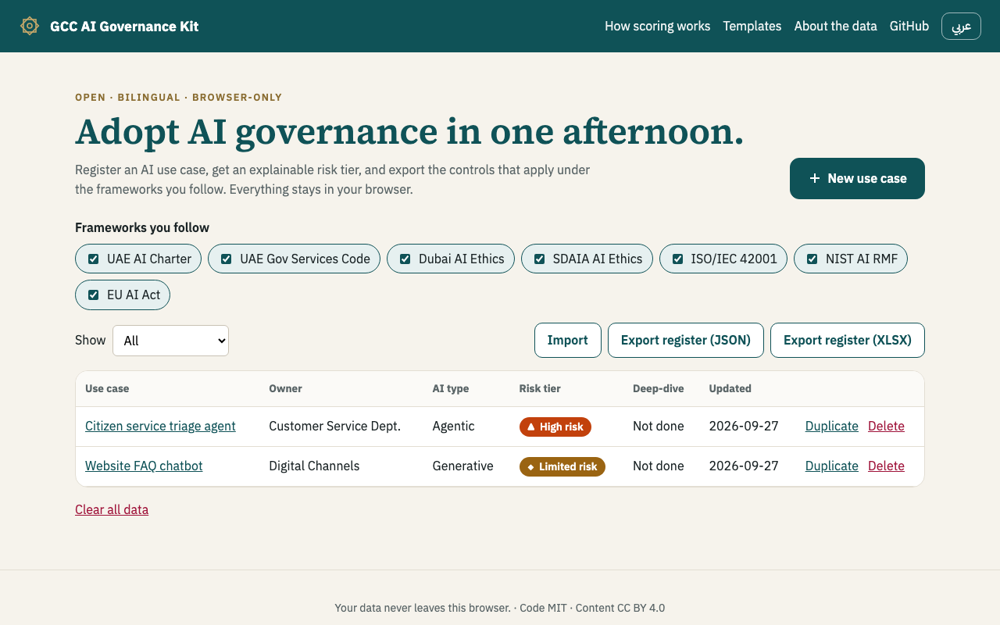
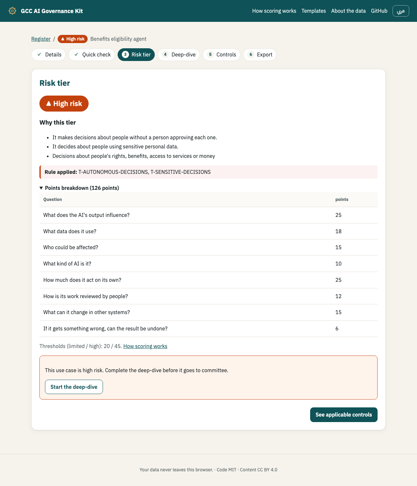
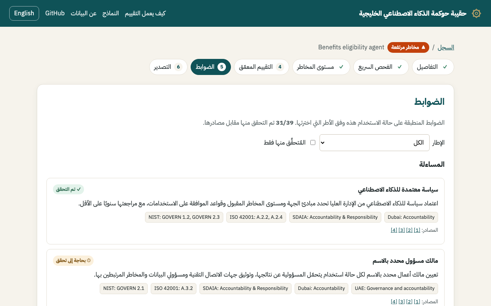

<div align="center">

# GCC AI Governance Kit · حقيبة حوكمة الذكاء الاصطناعي الخليجية

**Adopt AI governance in one afternoon, in Arabic and English.**

[**Try it live →**](https://agibalya2b.github.io/gcc-ai-governance-kit/) · [User guide](https://agibalya2b.github.io/gcc-ai-governance-kit/#/guide) · [Templates](https://agibalya2b.github.io/gcc-ai-governance-kit/#/templates) · [How scoring works](https://agibalya2b.github.io/gcc-ai-governance-kit/#/scoring) · [العربية](#بالعربية)


 


</div>

## Why this exists

GCC governments and large organisations are deploying AI faster than they can govern it. The principles exist: the
UAE AI Charter, the UAE Code for Government Services, Dubai's AI Ethics Guidelines, SDAIA's AI Ethics Principles,
ISO/IEC 42001 and the NIST AI RMF. The
practical layer does not. Teams still build their use-case register, risk tiering and control list by hand, in
English-only spreadsheets. **Agentic AI** also raises questions the classic questionnaires never ask: how autonomous
is it, who approves its actions, what systems can it change, and can those actions be undone?

This kit is that practical layer. It is open, free and bilingual, and it runs entirely in your browser.

## What you get

| | |
|---|---|
| **Use-case register** | Record AI use cases with owner, purpose and status. Saved only in your browser; export and import as JSON or XLSX. |
| **Two-level risk questionnaire** | An 8-question *Quick check* (including four agentic-AI factors) gives a first tier in about 2 minutes; a 10-question *Deep-dive* can only raise it. |
| **Explainable tier** | Four tiers aligned to SDAIA's risk levels. Every weight is visible, rules that set a minimum tier are named, and the top reasons are in plain language. |
| **Framework-filtered controls** | 58 controls across six themes, mapped to the UAE AI Charter, the **UAE Code for Government Services and Zero Bureaucracy** (with the federal agentic-AI guide, national reference and data-sharing policy), Dubai AI Ethics, SDAIA, ISO/IEC 42001 (clause numbers only), NIST AI RMF and the EU AI Act. Pick the frameworks you follow. |
| **Recommended autonomy** | Three prioritisation questions (usage, complexity, readiness), from the UAE AI-assistant priority matrix, recommend how much autonomy the AI should have, and warn when a design goes beyond it. |
| **Honest verification** | Each control shows its sources and whether its references were checked against them: **50 of 58 verified**. See the [content audit](docs/content-audit.md). |
| **Committee-ready outputs** | A one-to-two-page *AI Use-Case Risk Summary* (print to PDF) with a sign-off block, plus control lists as CSV/XLSX with right-to-left Arabic sheets. |
| **User guide** | An in-app [guide](https://agibalya2b.github.io/gcc-ai-governance-kit/#/guide) in Arabic and English, with screenshots: the three steps, what each tier means, reading controls and badges, exports and backups. Also as PDF: [English](docs/USER-GUIDE.pdf) · [العربية](docs/USER-GUIDE-ar.pdf). |
| **Templates** | Register, impact assessment and control checklist in Arabic and English (XLSX, CSV, Markdown) for teams that prefer spreadsheets or work offline. You don't need them to use the app. |

## Try it in 60 seconds

1. Open the **[live site](https://agibalya2b.github.io/gcc-ai-governance-kit/)** and click **Load 2 sample use cases**.
2. Open *Citizen service triage agent* to see why it is **High risk**.
3. Click **See applicable controls**, then **Committee PDF**.
4. Switch to **عربي**: the whole flow, the exports and the report work right-to-left. The site opens in English; your
   language choice is remembered.

No sign-up, no backend, no API key. Nothing you type leaves the browser; an automated test checks this on every change.

## Screens

| Register | Explainable tier | Controls (Arabic, RTL) |
|---|---|---|
|  |  |  |

## How the risk tier works

`tier = max(points tier, highest rule that fired)`

- Each answer carries visible points. The bands are Little/No < 20 ≤ Limited < 45 ≤ High.
- Rules set a minimum tier:
  - prohibited uses (social scoring, manipulation, real-time biometric surveillance) → **Unacceptable**;
  - autonomous decisions about people or about other companies, decisions based on sensitive data, or autonomous
    irreversible actions on the public → **High**.
- Eight reference cases are locked as tests, so a change to the weights cannot silently shift real outcomes. They range
  from a website FAQ chatbot (Limited) to citizen social scoring (Unacceptable).

The reasoning behind these choices is recorded in [ADR 002](docs/decisions/002-risk-tier-scoring.md).

**Recommended autonomy** is separate from risk. The UAE priority matrix combines usage intensity, complexity and readiness into four levels, numbered as the matrix numbers them: 1 full autonomous execution, 2 supervised autonomy, 3 AI assistance, and 4 not suitable yet. A High tier or a regulated domain never allows level 1. See [ADR 006](docs/decisions/006-autonomy-levels-follow-official-numbering.md).

## Adopting it in your organisation

- **As-is:** use the live site. Each person's register stays in their own browser, and teams share it by exporting
  and importing.
- **Fork it:** edit `data/questions.json` (questions, weights, rules) and `data/crosswalk.json` (controls,
  references) to match your policies. Both are validated against JSON Schemas in CI.
- **Spreadsheets only:** download the templates from `public/templates/` or the Templates page.

## Scope and honesty

- This is guidance, not legal advice, and not a certification tool.
- The UAE Charter's official pages could not be retrieved automatically, so rows citing it are marked *needs
  verification* until they are checked by hand.
- ISO/IEC 42001 is a paid standard. The kit cites clause and Annex A numbers only and paraphrases in its own words.
- The mappings are the kit's interpretation, not endorsed by any framework body.
- UAE Government Services Code references cite card numbers (e.g. "Code 5.2"). The Data Sharing Policy and the Agentic
  AI National Reference are cited by article or page; see the [content audit](docs/content-audit.md).

## Built with

TypeScript and Vite, with no framework. Tests: Vitest (scoring, exports, i18n) and Playwright (EN and AR end-to-end,
plus a check that no data leaves the browser). SheetJS for XLSX. Self-hosted IBM Plex Sans, IBM Plex Sans Arabic,
Source Serif 4 and Noto Kufi Arabic. Deployed to GitHub Pages by GitHub Actions.

Planning documents are in [`docs/planning-artifacts`](docs/planning-artifacts): brief, PRD, UX specification and
epics. Architecture decisions are in [`docs/decisions`](docs/decisions).

```bash
npm ci && npm run dev      # local development
npm test && npm run e2e    # unit and end-to-end tests
```

## Roadmap

- v0.3: verify the remaining UAE Charter rows; an agentic pre-launch readiness checklist per use case (from the federal
  agentic-AI guide); sector packs for UAE banking (CBUAE), Qatar (QCB) and telecoms; DIFC Regulation 10.
- Later: shareable read-only links, and an assessment-history diff per use case.

Contributions are welcome. Corrections to mappings are the most valuable; see [CONTRIBUTING.md](CONTRIBUTING.md).

## Author

**Ahmed Omar**, AI adoption and governance leader based in the UAE. Built by a practitioner who has led AI adoption
and governance programmes in UAE federal government.
[LinkedIn](https://www.linkedin.com/in/ahmedomar-transformation)

---

## بالعربية

**حقيبة مفتوحة ومجانية وثنائية اللغة لحوكمة الذكاء الاصطناعي في دول الخليج.** تتيح لك:
- تسجيل حالات استخدام الذكاء الاصطناعي؛
- الحصول على مستوى مخاطر قابل للتفسير، يشمل عوامل الذكاء الاصطناعي الوكيلي: الاستقلالية، والإشراف البشري،
  وصلاحيات الأنظمة، وإمكانية التراجع؛
- تصدير الضوابط المنطبقة وفق الأطر التي تختارها: ميثاق الإمارات، وأخلاقيات دبي، وسدايا، وآيزو 42001، وإطار NIST،
  وقانون الاتحاد الأوروبي، إضافةً إلى كود الإمارات للخدمات الحكومية وتصفير البيروقراطية والدليل الاتحادي للذكاء الاصطناعي المساعد. وتوصي الحقيبة بمستوى الاستقلالية المناسب للذكاء الاصطناعي وفق مصفوفة الأولويات الحكومية.

تعمل بالكامل داخل المتصفح، ولا تغادر بياناتك جهازك.
تُفتح الواجهة بالإنجليزية؛ اضغط «عربي» في أعلى الصفحة وسيُحفظ اختيارك.
[جرّبها الآن](https://agibalya2b.github.io/gcc-ai-governance-kit/) · [دليل الاستخدام (PDF)](docs/USER-GUIDE-ar.pdf)

**الترخيص:** الشيفرة بترخيص MIT، والمحتوى والنماذج بترخيص CC BY 4.0. هذه الحقيبة إرشادية وليست استشارة قانونية.
